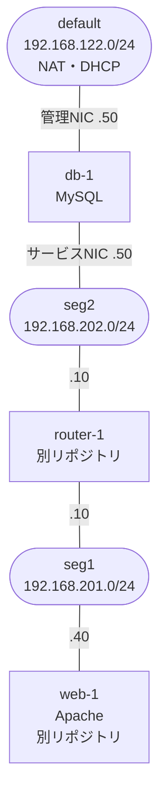

# minivps-db-appliance

[mini-vps-platform](https://github.com/0x69d/mini-vps-platform)上で、seg2にDB層を提供するDBアプライアンスVM用のゴールデンイメージ・VM spec・ゲスト内設定一式。

## これは何のためのリポジトリか

mini-vps-platformにはこれまで、実際のワークロードを載せて層ごとにセグメントを分ける構成の実例が無かった。本リポジトリは[minivps-web-appliance](https://github.com/0x69d/minivps-web-appliance)と対になり、web層(seg1)とDB層(seg2)をrouter-1で分離して、web層からしかDBに到達できない構成を実現する。

db-1が担うのはMySQLの稼働と、seg1からの接続のみを受け付けること。この到達制御は二重で、router-1のforward chainがセグメント間を、db-1自身のnftables input chainが受信を絞る。

## 前提条件

- mini-vps-platformがセットアップ済み(`~/.ssh/minivps_ed25519.pub`公開鍵、`seg2`ネットワーク、`images`ストレージプール、`ubuntu-26.04.img`が`images`プールに存在すること)。
- [minivps-router-appliance](https://github.com/0x69d/minivps-router-appliance)のrouter-1が稼働し、3306の許可ルールが追記されていること。無いとforward chainの既定拒否でweb-1から届かない([router-1側の許可ルール](#router-1側の許可ルール)参照)。
- ホストで`net.bridge.bridge-nf-call-iptables`が0であること。1だと送信元IPがホストに書き換えられ、この構成の到達制御が成立しない([送信元IPの保存](#送信元ipの保存)参照)。
- `tests/check-mysql-conf.sh` を回す場合はホスト側に `mysql-server-core`。

## アーキテクチャ



| ネットワーク | CIDR | db-1のIP | 用途 |
|---|---|---|---|
| default | 192.168.122.0/24 | 192.168.122.50 | 管理(SSH) |
| seg2 | 192.168.202.0/24 | 192.168.202.50 | MySQL提供 |

db-1はseg2への単一配置とし、web-1(192.168.201.40)からはrouter-1経由で到達させる。このためspecにseg1宛の戻り経路(`static_routes: via 192.168.202.10`)を宣言している。これが無いと、接続はweb-1→router-1→db-1と届くのに、応答がデフォルトルートへ非対称に流れて返らない。

受信制御: specの`filters`は未設定とし、router-1/dns-1と同様、ゴールデンイメージに焼き込んだゲスト内nftablesのinput chainが受信制御を担う。3306はseg1(192.168.201.0/24)から、22/tcpは管理ネット(192.168.122.0/24)からのみ許可、診断用ICMP許可、他はデフォルト拒否。

MySQLの`bind-address`は0.0.0.0のままにしている。mysql.serviceの依存は`network.target`止まりで`network-online.target`を待たないため、seg2側IPに絞るとnetplanがアドレスを付ける前の起動でbindに失敗しうるため。到達制御は上記のinput chainが担う。`image/etc/mysql/mysql.conf.d/zz-minivps.cnf`と`image/etc/nftables.conf`は一組で、片方だけ変更するとどこからでも接続できる状態になる。

rootはUbuntu既定の`unix_socket`認証のままで、パスワードは焼き込まない。ローカルのSSH経由でのみ使うため。

### 送信元IPの保存

この構成の到達制御は、db-1に届くパケットの送信元がweb-1の192.168.201.40のままであることに依存している。router-1自身はSNATしない(`minivps-router-appliance`のrulesetは`table inet filter`のみでnatテーブルを持たない)が、ホスト側の設定次第で書き換わる。

`br_netfilter`が有効でかつ`net.bridge.bridge-nf-call-iptables`が1だと、ブリッジ上のフレームがホストのnftablesを通り、libvirtがNATネットワークごとに持つmasqueradeルール(`ip saddr 192.168.201.0/24 ip daddr != 192.168.201.0/24 ... masquerade`)に一致してしまう。結果として送信元はセグメントのゲートウェイIP(192.168.201.1、さらにrouter-1通過後は192.168.202.1)に書き換えられ、

- db-1のinput chainの`WEB_NET`許可に一致せず、接続が落ちる
- 一致させたとしてもMySQL側の`'appuser'@'192.168.201.40'`に一致しない

の2段で失敗する。ホスト側で無効化する:

```bash
sudo sysctl -w net.bridge.bridge-nf-call-iptables=0
```

`br_netfilter`はDockerが読み込み、この値を1にする。恒久化する場合はDockerのネットワーク分離に影響しうる点に注意する。0にすると送信元が保存され、db-1で`select user()`が`appuser@192.168.201.40`を返す。

名前解決は管理NICの`nameservers`でdefaultセグメントのlibvirt dnsmasqを指定している。全NICが静的だとnetplanがリゾルバを持たず、運用者がaptを叩けなくなるため。

## クイックスタート

1. ゴールデンイメージをビルドする:
   ```bash
   ./build/build-golden-image.sh
   ```
   完了すると `images` プールに `minivps-db-golden-YYYYMMDD.qcow2` という名前で配置される。出力メッセージで実際のファイル名を確認する。

2. `specs/db-1.yaml` の `base_image` を、ビルドで得られたファイル名に書き換える。

3. VMを作成する(mini-vps-platform側で):
   ```bash
   uv run mini-vps create /path/to/minivps-db-appliance/specs/db-1.yaml
   ```

4. 管理アクセスを確認する:
   ```bash
   uv run mini-vps status db-1   # ip: 192.168.122.50 が返る
   ssh -i ~/.ssh/minivps_ed25519 ubuntu@192.168.122.50
   sudo ss -lntp | grep 3306     # 0.0.0.0:3306 でリッスンしている
   ```

5. [秘密情報の初期化](#秘密情報の初期化)を行う。これを終えるまでweb-1から接続できない。

## 秘密情報の初期化

ゴールデンイメージにはアプリ用DBユーザーを焼き込んでいない。これは、イメージやgit履歴に秘密が残るのを防ぐため。VM初回起動後にdb-1で以下を実行する:

```bash
# 接続元はweb-1のIPに限定する。seg1全体を許可する場合は 'appuser'@'192.168.201.%'
# パスワードをコマンドラインに直接書くと ~/.bash_history に平文で残る。
# read -s で受けて標準入力からmysqlへ流せば、履歴に残るのは変数名だけになる。
# パスワードに ' や \ は使わない。IDENTIFIED BY '...' の引用が壊れるため。
read -rsp 'appuser password: ' APPUSER_PW; echo
sudo mysql <<SQL
CREATE USER 'appuser'@'192.168.201.40' IDENTIFIED BY '${APPUSER_PW}';
CREATE DATABASE appdb;
GRANT ALL ON appdb.* TO 'appuser'@'192.168.201.40';
FLUSH PRIVILEGES;
SQL
unset APPUSER_PW
```

パスワードはリポジトリにもspecにも書かない。動作確認はweb-1から行う(クライアントはminivps-web-applianceのゴールデンイメージに含まれる):

```bash
mysql -h 192.168.202.50 -u appuser -p appdb -e 'select 1'
```

## router-1側の許可ルール

web-1からdb-1(192.168.202.50)の3306へ到達させるには、router-1の許可リストであるminivps-router-applianceの `/etc/nftables.d/90-segment-allow.conf`に運用者が以下を追記する:

```
add rule inet filter forward ip saddr 192.168.201.0/24 ip daddr 192.168.202.50 tcp dport 3306 accept
```

逆方向(db-1→web-1)のルールは追加しない。forward chainの`ct state established,related accept`が応答を拾うため、新規セッションの向き1本で足りる。

追記後は必ずメインファイル経由でreloadする:

```bash
sudo systemctl reload nftables
```

このルールは稼働中のrouter-1に対する手編集のため、router-1をゴールデンイメージから作り直すと失われる。

## tests

- `tests/lint-nftables.sh` — nftables.confの構文チェック(要`nft`・CAP_NET_ADMIN。sudoで実行する)。
- `tests/check-mysql-conf.sh` — `zz-minivps.cnf`だけを読ませての`mysqld --validate-config`(要`mysql-server-core`)。

## トラブルシューティング

- ビルドがタイムアウトした場合: 調査のためビルドVMとそのディスクは意図的に残される。表示されるSSH手順で `cloud-init status --long` と `/var/log/cloud-init-output.log` を確認する。cloud-initの初期段階で止まっているとSSHは通らないため、その場合は `virsh console <ビルドVM名>` でシリアルコンソールから調査する。調査後は `virsh destroy <ビルドVM名>` で破棄すれば、残骸は次回実行の冒頭掃除が回収する。
- ホスト(192.168.202.1)から `mysql -h 192.168.202.50` がタイムアウトするのは仕様。ホストは管理ネットにもseg1にも該当しないため、db-1のinput chainで落ちる。動作確認はweb-1から行う。
- web-1から繋がらない: まずdb-1で`sudo tcpdump -i enp2s0 tcp port 3306`を回しながらweb-1から接続する。パケットが届かなければ経路か[router-1側の許可ルール](#router-1側の許可ルール)の問題。届いているのに応答が無く、かつ送信元が192.168.201.40以外(192.168.202.1など)なら[送信元IPの保存](#送信元ipの保存)を参照する。送信元が正しければDBユーザーの接続元指定(`'appuser'@'192.168.201.40'`)との不一致を疑う。
- `mini-vps status`が管理IP以外を返す場合: `specs/db-1.yaml`の`networks`の並び順(`default`が先頭かつ静的IPになっているか)を確認する。
- ゴールデンイメージには`/etc/mysql/debian.cnf`にパッケージ生成の`debian-sys-maint`パスワードが含まれる。`.gitignore`が`*.qcow2`を除外するのでgitには入らないが、イメージファイル自体を配布する場合は注意する。
- DHCPレンジとの重複: 192.168.202.50/192.168.122.50はいずれもlibvirt DHCPレンジ(.2〜.254)内にある。db-1は常時起動の運用を前提とし、長期停止させる場合は同アドレスのDHCP払い出しと衝突しうる点に注意する。
